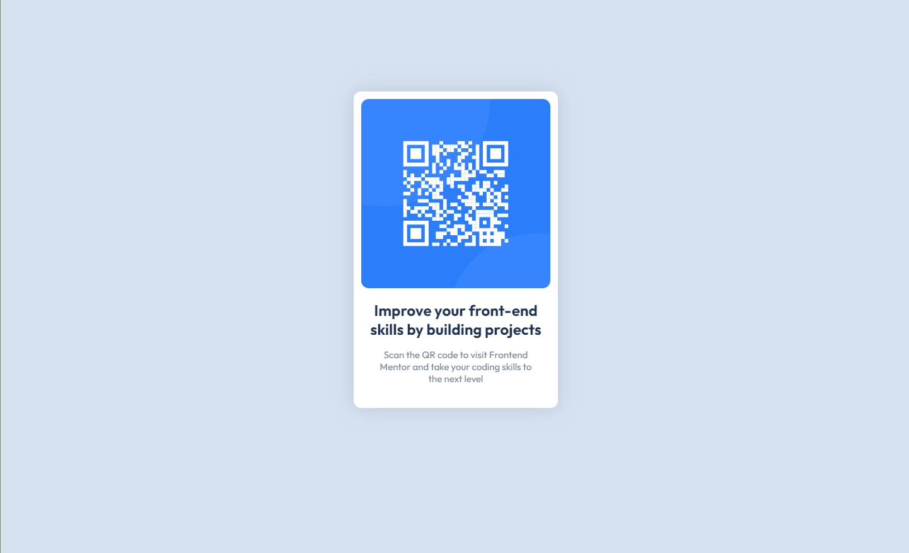

# Frontend Mentor - NFT preview card component solution

This is a solution to the [QR Code component challenge on Frontend Mentor](https://www.frontendmentor.io/challenges/qr-code-component-iux_sIO_H/hub/qr-code-for-desktop-site-18Y57zgDD). Frontend Mentor challenges help you improve your coding skills by building realistic projects. 

## Table of contents

- [Overview](#overview)
  - [The challenge](#the-challenge)
  - [Screenshot](#screenshot)
  - [Links](#links)
- [My process](#my-process)
  - [Built with](#built-with)
  - [What I learned](#what-i-learned)
  - [Continued development](#continued-development)
  - [Useful resources](#useful-resources)
- [Author](#author)
- [Acknowledgments](#acknowledgments)

## Overview

### Screenshot



### Links

- Solution URL: [Solution URL here](https://www.frontendmentor.io/solutions/qr-code-for-desktop-site-18Y57zgDD)
- Live Site URL: [Live site URL here](https://qr-code-frontend-mentor-kelseychristensen.vercel.app/)

## My process

### Built with

- CSS custom properties
- Flexbox
- CSS
- HTML


```css
.white-box {
  text-align: center;
  background-color: hsl(0, 0%, 100%);
  width: 300px;
  height: 100%;
  margin: auto;
  padding: 12px;
  border-radius: 12px;
  filter: drop-shadow(0 0 1rem rgb(48%, 53%, 62%, 30%));
}
```

### Continued development

I want  to learn more about flexbox for aligning items. 

## Author

- [Profile](https://github.com/kelseychristensen "Kelsey Christensen")
- [Email](mailto:kelsey.c.christensen@gmail.com?subject=Hi "Hi!")
- [Dribble](https://dribbble.com/kelseychristensen "Hi!")
- [Website](http://kelseychristensen.com/ "Welcome")

## Acknowledgments

Thank you to the community at FrontEnd mentor--especially other users who leave feedback!
